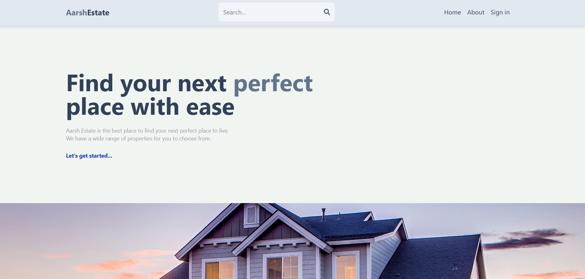
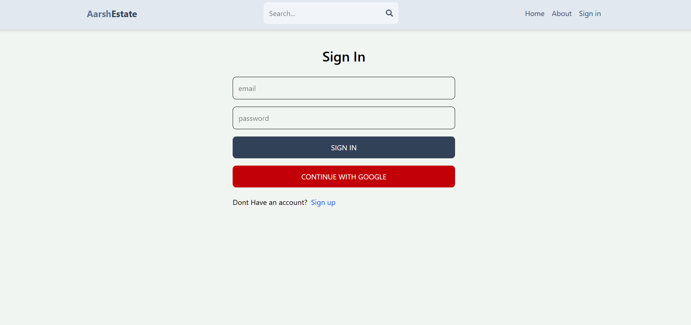
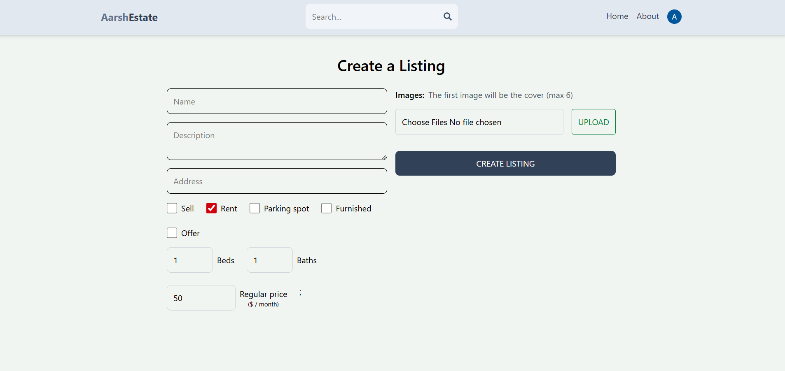
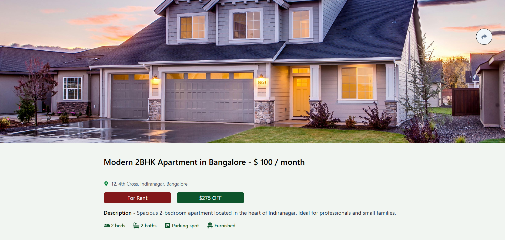

# MERN Estate - Full-Stack Real Estate Marketplace

[](https://opensource.org/licenses/MIT) A feature-rich web application built with the MERN stack allowing users to browse, list, and search for real estate properties for sale or rent. Includes user authentication, property management, and advanced search capabilities.

## Table of Contents

- [About The Project](#about-the-project)
  - [Built With](#built-with)
- [Screenshots](#screenshots)
- [Getting Started](#getting-started)
  - [Prerequisites](#prerequisites)
  - [Installation (API)](#installation-api)
  - [Installation (Client)](#installation-client)
- [Usage](#usage)
- [Features](#features)
- [Contact](#contact)

## About The Project

MERN Estate is a full-stack web application designed to simulate a real estate marketplace. Users can sign up, log in, create their own property listings (for sale or rent), upload images, manage their listings, and search for properties based on various criteria. The project demonstrates the integration of modern web technologies to build a dynamic and interactive user experience.

### Built With

* **Frontend:**
    * [![React][React.js]][React-url]
    * [![Redux Toolkit][Redux-logo]][Redux-url]
    * [![React Router][ReactRouter.com]][ReactRouter-url]
    * [![TailwindCSS][TailwindCSS.com]][Tailwind-url]
    * [![Swiper][Swiper.js]][Swiper-url]
* **Backend:**
    * [![Node][Node.js]][Node-url]
    * [![Express][Express.js]][Express-url]
* **Database:**
    * [![MongoDB][MongoDB.com]][Mongo-url] (with Mongoose)
* **Authentication & Storage:**
    * [![Firebase][Firebase.com]][Firebase-url] (Google OAuth & Image Storage)

## Screenshots

*(Add your actual screenshot files to an `images` folder in your repo and uncomment/update the paths below)*

| Home Page                                         | Sign In Page                                      |
| :------------------------------------------------ | :------------------------------------------------ |
|  |  |

| Create Listing Page                               | Listing Details                                   |
| :------------------------------------------------ | :------------------------------------------------ |
|  |  |


## Getting Started

Follow these instructions to set up the project locally.

### Prerequisites

* **Node.js & npm:** Make sure you have Node.js (which includes npm) installed. Download from [https://nodejs.org/](https://nodejs.org/)
* **MongoDB:** You need a running MongoDB instance (local or cloud-based like MongoDB Atlas). Get connection string.
* **Firebase Account:** Create a Firebase project to get API keys for Google Authentication and Storage.

### Installation (API)

1.  Clone the repo:
    ```sh
    git clone [https://github.com/Aarsh-Mishra/mern_estate.git](https://github.com/Aarsh-Mishra/mern_estate.git)
    ```
2.  Navigate to the API directory:
    ```sh
    cd mern_estate/api
    ```
3.  Install NPM packages:
    ```sh
    npm install
    ```
4.  Create a `.env` file in the `api` directory and add your environment variables:
    ```env
    MONGO=<Your MongoDB Connection String>
    JWT_SECRET=<Your JWT Secret Key>
    ```
5.  Start the API server:
    ```sh
    npm run dev
    ```
    The API will typically run on `http://localhost:3000`.

### Installation (Client)

1.  Navigate to the client directory from the root project folder:
    ```sh
    cd mern_estate/client
    ```
2.  Install NPM packages:
    ```sh
    npm install
    ```
3.  Create a `.env` file in the `client` directory and add your Firebase configuration:
    ```env
    VITE_FIREBASE_API_KEY=<Your Firebase API Key>
    ```
    *(Ensure other Firebase config details in `src/firebase.js` match your project)*
4.  Start the client development server:
    ```sh
    npm run dev
    ```
    The client application will typically run on `http://localhost:5173` (or another port specified by Vite).

## Usage

Once both the API and Client are running:

1.  Open your browser and navigate to the client URL (e.g., `http://localhost:5173`).
2.  **Sign Up/Sign In:** Create an account using email/password or use the Google OAuth option.
3.  **Browse Listings:** View available properties on the homepage.
4.  **Search:** Use the search bar or the dedicated search page to filter listings by term, type (rent/sale), offer, parking, and furnished status.
5.  **View Listing Details:** Click on a listing to see more details, including images, description, price, and amenities.
6.  **Create Listing:** Logged-in users can create new property listings, providing details and uploading images via Firebase Storage.
7.  **Manage Profile:** Update user profile information and view/edit/delete created listings.

## Features

* **User Authentication:** Secure signup/signin with email/password (using bcryptjs for hashing) and Google OAuth (via Firebase). JWT is used for session management.
* **Property Listings:** Full CRUD functionality for creating, reading, updating, and deleting property listings.
* **Image Uploads:** Multiple image uploads per listing, handled via Firebase Storage.
* **Advanced Search & Filtering:** Filter and sort listings based on various criteria (searchTerm, type, amenities, price, creation date).
* **Responsive Design:** User interface built with React and styled using Tailwind CSS for responsiveness across devices.
* **State Management:** Redux Toolkit used for efficient global state management (user authentication status).
* **Interactive UI Components:** Utilizes Swiper for image carousels on the listing page and homepage.
* **Contact Landlord:** Feature allowing users to send messages (via mailto link) to the property owner.

## Contact

Aarsh Mishra - <aarshm21@gmail.com>

Project Link: [https://github.com/Aarsh-Mishra/mern_estate](https://github.com/Aarsh-Mishra/mern_estate)

[React.js]: https://img.shields.io/badge/React-20232A?style=for-the-badge&logo=react&logoColor=61DAFB
[React-url]: https://reactjs.org/
[Redux-logo]: https://img.shields.io/badge/Redux-593D88?style=for-the-badge&logo=redux&logoColor=white
[Redux-url]: https://redux-toolkit.js.org/
[ReactRouter.com]: https://img.shields.io/badge/React_Router-CA4245?style=for-the-badge&logo=react-router&logoColor=white
[ReactRouter-url]: https://reactrouter.com/
[TailwindCSS.com]: https://img.shields.io/badge/Tailwind_CSS-38B2AC?style=for-the-badge&logo=tailwind-css&logoColor=white
[Tailwind-url]: https://tailwindcss.com/
[Node.js]: https://img.shields.io/badge/Node.js-339933?style=for-the-badge&logo=nodedotjs&logoColor=white
[Node-url]: https://nodejs.org/
[Express.js]: https://img.shields.io/badge/Express.js-000000?style=for-the-badge&logo=express&logoColor=white
[Express-url]: https://expressjs.com/
[MongoDB.com]: https://img.shields.io/badge/MongoDB-47A248?style=for-the-badge&logo=mongodb&logoColor=white
[Mongo-url]: https://www.mongodb.com/
[Firebase.com]: https://img.shields.io/badge/Firebase-FFCA28?style=for-the-badge&logo=firebase&logoColor=black
[Firebase-url]: https://firebase.google.com/
[Swiper.js]: https://img.shields.io/badge/Swiper-007AFF?style=for-the-badge&logo=swiper&logoColor=white
[Swiper-url]: https://swiperjs.com/
